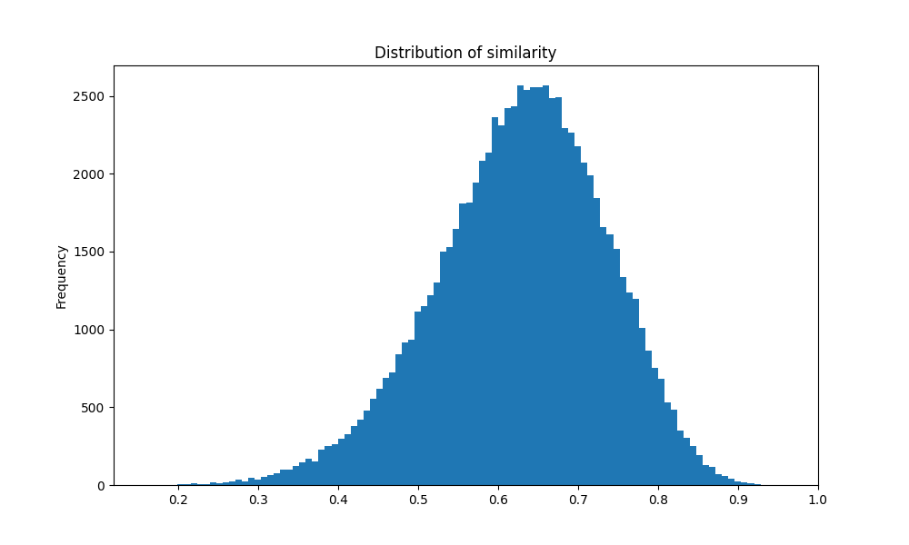
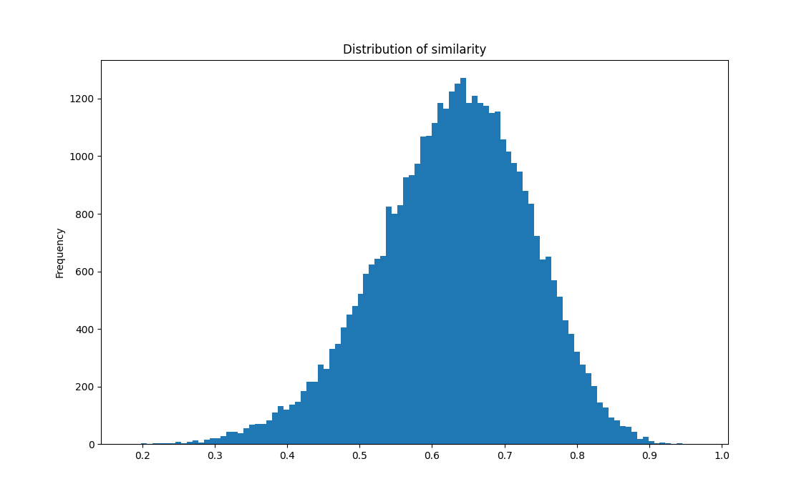

# **COCO Train Dataset Cap-Similarity Dist**
> ### Similarity_Distribution  

 

> ### The least similar example
* 'A man and a woman traveling down a road in front of building.'
* "A woman is riding down a hill on a child's toy"
* 'some dude tryng to score outside the trap house'
* 'two males and a female and one is looking out a window'
*  'Three people in a neighborhood conversing about something.'

    ### **Similarity:  0.159481**
 

> ### The most similar example 
* 'A black and white cat sitting in a chair. '
* 'A black and white cat sits on a brown chair.' 
* 'a black and white cat seated on the chair' 
* 'A black and white cat sitting on a chair.'
* 'A black and white cat sitting on a chair.'

    ### **Similarity:  0.960225**  
 

  
  
# **COCO validation Dataset Cap-Similarity Dist**
> ### Similarity_Distribution

 

> ### The least similar example  
* 'The animal food tray and cage is empty.'
* 'some kind of cage that is next to a tree' 
* 'a couple of frisbees are stuck in a small tower' 
* 'A view of a piece of art near a tree.'
* 'A Frisbee golf net in a park with several Frisbee in it.'

    ### **Similarity: 0.182616**
 

> ### The most similar example  
* 'Someone using a cell phone to take a picture of a baby.'    
* 'someone taking a picture of a baby using a cell phone.'   
* 'A person taking a picture of a baby on a cell phone.'  
* 'A person uses their cellphone to take a picture of a baby'   
* 'a person taking a photo of a baby with their cell phone '

    ### **Similarity:  0.969442**

